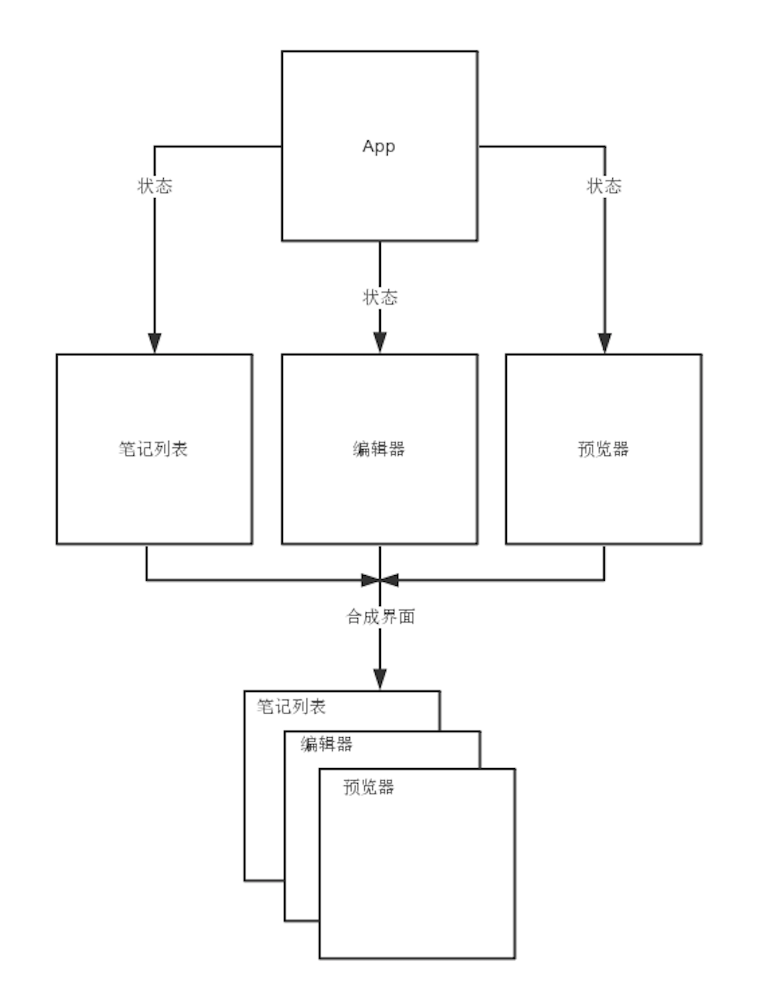

# Marknote

一个轻量 PWA 笔记应用。  


## 功能

- 支持 Markdown
- 支持笔记的导入/导出
- 支持搜索笔记
- 支持断网使用以及本地保存
- 支持桌面设备/移动设备

## 开发模式

```bash
npm install
npm run dev
# http://localhost:3000
```

## 构建模式

```bash
npm run build
```

## 目录

```
|- public 静态资源
|- src 源码
  |- components 通用组件
  |- containers 容器
    |- Editor 编辑器
    |- NoteList 笔记列表
    |- Preview 笔记预览
  |- utils 工具函数
  |- constants.js 常量
  |- store.js 本地存储相关
```

## 常见问题

### 如何进行多设备同步

> 目前只支持本地导出然后手动同步到其他设备。如果想支持多设备自动同步，修改`src/store.js`中的方法与你的服务器进行通信而不是与本地 storage 通信，这样可以实现多设备同步。

### 导入笔记偶尔选取文件无效

> 一般重新导入就可以了。可能是`src/utils/selectFile.js`的 BUG，目前还没找到原因。

### 部分浏览器无法导出

> 导出功能由`FileSaver.js`提供，所以受`FileSaver.js`兼容性的影响。另外可能原因是部分浏览器屏蔽了下载功能。

## 设计

### 界面


